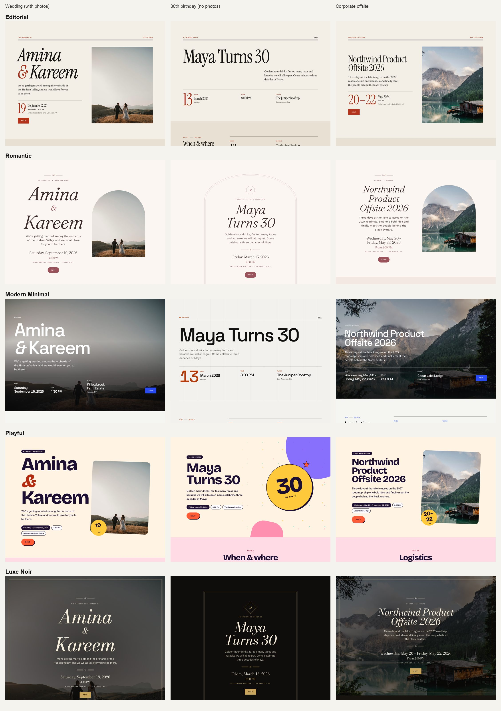

# Event site design system

Five styles (Editorial, Romantic, Modern Minimal, Playful, Luxe Noir) built from a hand-crafted section library (`src/components/event-sections/`) and a deterministic layout function (`designEventSite` in `src/lib/event-design/`). The AI acts as art director (picks style, palette, sections, writes copy); it never invents layout.

Preview locally (not available in production): run the `eventloom-demo` launch config and open `/design-preview`.

Approved by the owner on 2026-10-08 for rollout to all new events.
